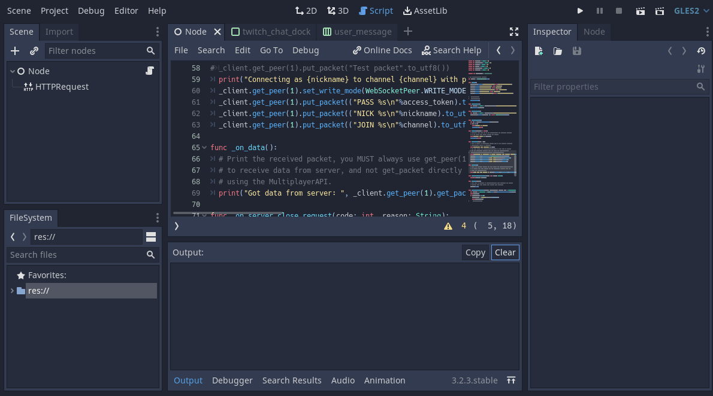

# godot-engine.editor-twitch-chat
Integrate the chat of your Twitch Channel inside Godot Engine's editor! Enable it when you are doing a dev-stream or just want to check your Twitch chat while coding.

